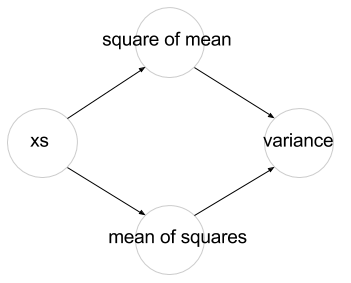
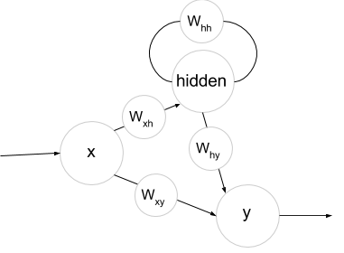

# Фло

[](https://travis-ci.org/MikeInnes/Flow.jl) [](https://coveralls.io/github/MikeInnes/Flow.jl?branch=master)

Flow is a Julia library providing data structures and algorithms for expressing and manipulating directed cyclic multigraphs, designed as a toolkit for building embedded languages with dataflow semantics.

> Say what now?

What's the common thread among frameworks for things like parallel computing (Spark, ComputeFramework), machine learning (Theano, TensorFlow), hardware modeling and simulation (LabVIEW, Simulink), and so on? The answer is that they all take advantage of some kind of *dataflow* semantics. Instead of dealing with variables, state and updates, they explicitly model the flow of data through various operations in the program. This is well founded, as it allows for all kinds of nice things like eliding memory allocations, automatically differentiating equations, and exploiting opportunities for parallelism.

At its most basic, Flow is a shared set of functionality for building such frameworks, providing the tools to represent programs and implement common optimisations. But it's also designed to solve a much deeper problem. Many of the frameworks above implement their own custom language and embed it into a host like Scala or Python, but that language then lacks fundamental features like syntax or functions. In their place, you build and evaluate expression trees by hand, something analogous to:

```julia
f(x) = :($x + $x)
f(2) == :(2+2)
eval(f(2)) == 4
```

You can pull off a few hacks to make this style convenient, of course, but fundamentally it's a hassle for both the human and the compiler. One of Flow's key goals is to enable framework designers to return from a "building expression trees" API to a "functions + data" one, making the programming more intuitive and composable for the user, and easier to implement for the developer.

Key goals:

* Consistent APIs, code sharing, and interoperability across dataflow-based frameworks
* A dataflow programming model consistent with the host language
* Tight integration with the host, including transparent, bi-directional interop
* Equation salvation from the `tf.matmul`/`tf.add` tf.tarpit

## Examples

Consider a simple function for calculating variance:

```julia
@flow function var(xs)
  mean = sum(xs)/length(xs)
  meansqr = sumabs2(xs)/length(xs)
  meansqr - mean^2
end
```

This looks like (and is) perfectly valid Julia code, but the `@flow` annotation out front makes a big difference; instead of being stored internally as an AST, the code is stored as a directed graph like this:



The variables are stripped out and we directly model how data moves between different operation. Notice that, for one thing, this makes opportunities for parallelism structurally obvious.

We can run common subexpression elimination on the graph as follows:

```julia
julia> Flow.cse(var.output)
Flow.IVertex{Any}
chamois = length(xs)
sumabs2(xs) / chamois - (sum(xs) / chamois) ^ 2
```

Multiple things have happened to transform our original code. `mean` and `meansqr` did not need to be assigned variables, so they weren't. Conversely, `length(xs)` *is* assigned a variable name because the result is used more than once. Another thing you can try is modifying `var` to contain an unused variable, and noticing that it gets stripped out. This seems like a very complex syntax operation, but `cse` is implemented in only a couple of lines.

Another unusual feature of Flow is that it supports cycles, for example:

```julia
@flow function recurrent(x)
  hidden = σ( Wxh*x + Whh*hidden )
  y = σ( Why*hidden + Wxy*x )
end
```

This is not valid Julia, since `hidden` must be defined before it is used. In Flow this is simply represented as a graph like the following:



Applications that build on Flow can decide what meaning to give to structures like this. For example, an ANN library might unroll the network a given number of steps at a cycle, enabling recurrent neural network architectures to be easily expressed.
